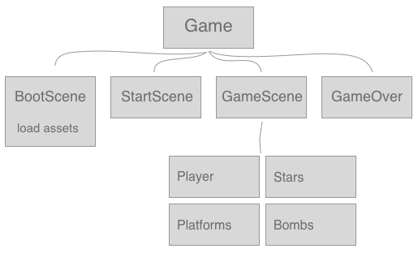

# Phaser 3 Workshop

Let's build a [Phaser 3](https://phaser.io/phaser3) Game with [Typescript](https://www.typescriptlang.org) and [Parcel](https://parceljs.org) 🤯

### [View the end result](https://hr-cmgt.github.io/CLE4-phaser-workshop/)

## Workshop Contents

- Preparations
- Components of the game
- Typescript Classes
- Game settings
- Scenes
- Adding images and text
- Button
- Adding a Sprite
- Arcade Physics
- Controls
- Using Groups
- Platforms
- Collisions
- Keeping score and drawing a life bar
- Camera and world size
- Finished workshop files
- Documentation
- Using Parcel

## Preparing

Install all the tools. You need [NodeJS 10](https://nodejs.org/en/) to use `npm`. (Node 12 may have some issues!).

```
sudo npm install -g typescript
sudo npm install -g parcel-bundler
```
Clone or download this repository. Create the `node_modules` folder. Then, check if everything is running:
```
npm install
npm run start
```
Open `http://localhost:1234` to view the project!

## Components of the game



## Typescript Classes

A generic Typescript class looks like this. You don't need `let` when declaring properties (`lives`). Methods (`showLives`) don't need the `function` keyword. The `create` and `update` methods are automatically called by Phaser. The `this` keyword is used to refer to properties (`lives`) and methods (`showLives`) of a class.
```typescript
export class Player {

    lives = 3

    constructor() {
        console.log("I am a player")
    }

    create() {
        this.showLives()
    }

    showLives(){
        console.log("Number of lives: " + this.lives)
    }

    update(){
        console.log("Updating 60 times per second")
    }
}
```
## Game Settings

Look at `app.ts` to decide the main settings for your game. Points of interest are the physics engine and gravity value, the canvas size and the `pixelArt` rendering option.

## Scenes

A scene is a game screen. This project uses 4 scenes. In `app.ts` you have to define which scenes you use. `import` the scene and add it to the `scenes` variable
```
scene: [BootScene, StartScene, GameScene, EndScene],
```
Look at `start-scene.ts` to see the setup for a simple scene. You can switch scenes during your game:
```
this.scene.start('StartScene')
```
The `boot-scene` is used to preload all game assets. An image assets gets a keyword (`sky`) to reference it later in the game. Once all images are loaded, the boot-scene automatically starts the start-scene
```
this.load.image('sky', require('../assets/background.jpg'))
```

## Adding images and text to a scene

Use `addImage` and `addText` to add images and text to a scene. By using `setOrigin()` you decide the center point of images and text. 

```typescript
export class GameScene extends Phaser.Scene {

    constructor() {
        super({key: "GameScene"})
    }
    
    public create(): void {
        this.add.image(0, 0, 'background')
        this.add.image(0, 0, 'item').setOrigin(0, 0)
        this.add.text(40, 150, 'Lives: 3', { fontFamily: 'Arial', fontSize: 40, color: '#FFF' })
    }
}
```

## Buttons

You can detect pointer clicks on a whole scene:
```typescript
create() {
    this.input.once('pointerdown', (pointer) => {
        this.scene.start('GameScene')
    })
}
```

By using `setInteractive()` on a gameobject you can create single buttons
```typescript
create() {
    let btn1 = this.add.image(100,500, 'mybutton')
    btn1.setInteractive()
    btn1.on('pointerdown', (pointer) => {
        this.scene.start('GameScene')
    })
}
```

> ## Practice 
> Give each scene a different background image and text. To use your own images, load them in `boot-scene`! We will add code to switch between scenes:
> 
> In the boot scene, use `this.scene.start('StartScene')` to go to the startscene when all images are loaded. In the `StartScene`, create a button or a generic click handler, which will take the player to the `GameScene`. Do the same for the `EndScene`. Check if we can switch between scenes now!

## Adding a sprite

You can add a sprite in several ways, but in this workshop we will use `classes` to add new physics sprites. First we need a class in the `objects` folder. The sprite adds itself to the scene and the physics world in the constructor function. Because this is a physics sprite, we can also add velocity.

```typescript
export class Player extends Phaser.Physics.Arcade.Sprite {

    constructor(scene: Phaser.Scene) {
        super(scene, 20, 30, "rock")       
        this.scene.add.existing(this) 
        this.scene.physics.add.existing(this) 
        this.setVelocity(20, 0)
    }

    update(){
    }
}
```
Then, we can add sprites to a scene in the `game-scene` class. We also need to update our sprite in the `update` function of our scene!
```typescript
import { Player } from "../objects/player"

export class GameScene extends Phaser.Scene {
     
    player

    create(): void {
        this.player = new Player(this)
    }

    update(){
        this.player.update()
    }
}
```
## Arcade Physics

By creating an arcade sprite and adding it to the physics list, the sprite is affected by gravity and can cause collisions. Moving a physics sprite is done by altering it's velocity, instead of updating `x,y` values.

To slow down a sprite that has velocity, you can set a `drag` value **or** you can scale down the velocity in the update function.
```typescript
create(){
    this.setVelocityX(200)
    this.setDragX(600)
}
update(){
    this.body.velocity.scale(0.95)
}
```

## Controls

A sprite can listen to keyboard input. When the cursor keys are pressed, change the velocity of the sprite.
```typescript
constructor(){
    this.cursors = this.scene.input.keyboard.createCursorKeys()
}
update(){
    if (this.cursors.left.isDown) {
        this.setVelocityX(-200)
    } else if (this.cursors.right.isDown) {
        this.setVelocityX(200)
    } 
}
```

Only jumping while grounded, and using cooldowns:

```typescript
// only allow jump when standing on something
if (this.cursors.up.isDown && this.body.touching.down) {
    this.setVelocityY(-400)
}

// cooldown of 500 milliseconds for pressing the space bar
if(this.scene.input.keyboard.checkDown(this.cursors.space, 500)){
    this.gameScene.friendlyBullet()
}
```

> ## Practice
> Add the player to the game, by uncommenting the `this.player` code in the `GameScene`. In the player code, uncomment the lines one by one to see the effect of physics on the world.

## Using groups

Groups are a handy way to group sprites together. This way it's easier to check for collisions between the player and a whole group of sprites. Groups can automatically update themselves.

```typescript
import { Bomb } from "../objects/bomb"

export class GameScene extends Phaser.Scene {
     
    bombsgroup

    create(): void {
        this.bombsgroup = this.add.group()
        this.bombsgroup.add(new Bomb(this))
    }

    update(){
    }
}
```

## Collisions

By enabling collisions between objects and groups we cause the objects to bounce off each other, like objects in a real world.

Instead of checking for **collisions**, we can check for **overlap**. This means the objects won't bounce off each other. This is useful for objects that need to be removed once they interact, such as bullets or powerups.

```typescript
// the player bounces off the platforms
this.physics.add.collider(this.player, this.platforms)

// all the bombs bounce off the platforms
this.physics.add.collider(this.bombs, this.platforms)

// the player hits a bomb
this.physics.add.overlap(this.player, this.bombs)
```

### Callbacks

A callback is a function that gets executed once a collision or overlap happens. In this example we remove the star from the game once it overlaps with the player:
```typescript
create() {
    this.physics.add.overlap(this.player, this.stars, this.collectStar, null, this)
}
collectStar(player, star) {
    this.stars.remove(star, true, true)
}
```

> ## Practice
> We will add platforms to the platforms group. Create your own small level!

> ## Practice
> Now you know how to create a basic scene, let's take some time to practice. 
> - Create a new scene with a different layout of platforms
> - Add the scene to `app.ts`
> - If the player has collected all the stars in a scene, switch to the next scene!

## Enemies

We will add a bomb sprite to the game, and go to the gameover screen when the player hits the bomb. Feel free to experiment with adding more bombs and giving them random velocity. 

From here on, you can continue with building your game levels, or implement a score and a camera, as explained below.

## Keeping score and drawing a life bar

You can keep track of values between scenes by using the `registry`. This way, your end scene can know how much you scored in the game scene.

```
this.registry.values.score++
console.log(this.registry.values.score)
```

We can draw shapes by creating a `graphics` object. In the update function, we keep drawing a rectangle that uses the `lives` variable as its width.
```typescript
class GameScene {

    graphics
    lives = 300

    create(){
        this.graphics = this.add.graphics({ fillStyle: { color: 0x00AA00 } })
    }
    update(){
        this.graphics.clear()
        this.graphics.fillRectShape(new Phaser.Geom.Rectangle(20, 20, lives, 20))
    }
}
```

## Camera and world size

We can create a world that is larger than the canvas size, allowing us to design large levels! 

```typescript
this.physics.world.bounds.width = 1600
this.physics.world.bounds.height = 600
```

When the player walks out of view, we can tell the camera to follow the player. We have to tell the camera to never go beyond the world bounds.

```typescript
this.cameras.main.setSize(800, 600)          // canvas size
this.cameras.main.setBounds(0, 0, 1600, 600) // world size
this.cameras.main.startFollow(this.player)
```

## Finished workshop files

On the [github website](https://github.com/HR-CMGT/CLE4-phaser-workshop), click the `branch` dropdown and select `gh-pages` to peek in the finished files. This way you can compare the finished project with your own project. You can also click the `master` button in VS Code, to work in the finished project directly.

> ## Practice
> Check out the [workshop notes](notes.md) and see if you can add
> - Spritesheets for an animating character
> - Particles just because they're cool
> - Tweens for animating buttons

# Phaser documentation

Note that the official docs are in Javascript, which may need some small adjustments to work in a Typescript project.

- [Phaser 3 Examples](http://labs.phaser.io) - A great source for exploring. Click **EDIT** to see the source code 🤩,  for example: [Spritesheets](http://labs.phaser.io/view.html?src=src/animation\reverse%20animation.js), [Repeating tiles](http://labs.phaser.io/index.html?dir=game%20objects/tile%20sprite/&q=) and [Particles](http://labs.phaser.io/index.html?dir=game%20objects/particle%20emitter/&q=)
- [Phaser 3 Documentation](https://photonstorm.github.io/phaser3-docs/index.html)
- [Getting started with Phaser 3](https://phaser.io/tutorials/getting-started-phaser3)
- [Phaser 3 Coding Tips](https://phaser.io/learn/community-tutorials)

## Forum

- [Forum](https://phaser.discourse.group)

## Codecademy course

- [Game development with PhaserJS](https://www.codecademy.com/learn/learn-phaser)

## Typescript example projects

- [RuimteGruis by KokoDoko](https://github.com/KokoDoko/ruimtegruis) and [play it here](https://kokodoko.github.io/ruimtegruis/)
- [Phaser 3 Typescript OOP Setup and Example projects](https://github.com/digitsensitive/phaser3-typescript)
- [Tutorial: Build Flappy Bird with Phaser 3 and Typescript](https://medium.com/@digit.sensitivee/learn-to-create-a-html5-game-in-5-minutes-604118f5d0ab)
- [Check the Typescript example games](https://github.com/digitsensitive/phaser3-typescript/tree/master/src/games) to learn about specific game mechanics

# Using Parcel

Parcel will bundle your phaser modules that use `import` and `export`, and will convert Typescript to Javascript. Parcel will generate the `docs` folder for uploading to a web server 🧙.

### Building for production

This will create all the final files in the docs folder, ready for publishing online.

```sh
npm run build
```

If you use images or css in your project, you need to use `require`

```javascript
this.load.image('sky', require('../assets/background.jpg'))
```

- [Parcel: Getting Started](https://parceljs.org/getting_started.html)
- [Parcel: Production](https://parceljs.org/production.html)
- [Parcel: CLI options for compilation](https://parceljs.org/cli.html)

# Credits

This workshop was put together by Erik Katerborg for HR-CMGT. 

- Phaser platform basics : https://phaser.io/tutorials/making-your-first-phaser-3-game
- Parcel settings inspired by : https://github.com/samme/phaser-parcel
- Typescript OOP settings inspired by : https://github.com/digitsensitive/phaser3-typescript
